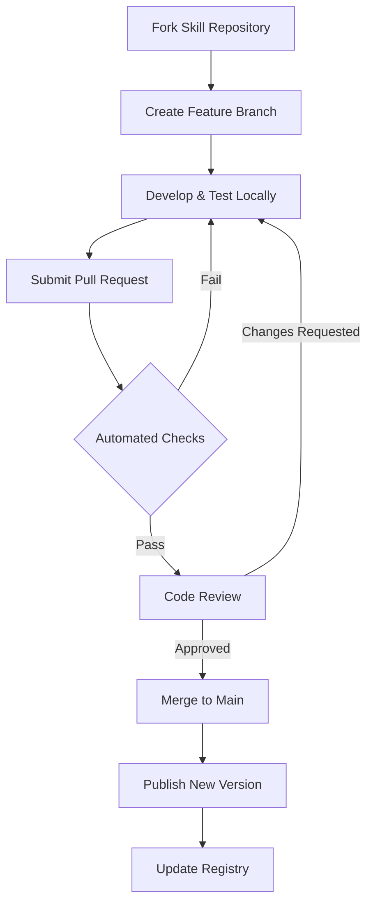

# Extensible Skills Interface Ecosystem Design for Langflow

**Date:** February 11, 2026  
**Version:** 1.0  
**Status:** Design Proposal

---

## Executive Summary

This document proposes a comprehensive design for an extensible Skills interface that enables a broader ecosystem around Langflow. The design focuses on enabling collaboration, versioning, community contributions, and seamless integration while maintaining security, quality, and backward compatibility.

**Key Goals:**
- Enable external developers to create and share reusable Skills
- Reduce code duplication through standardized, versioned components
- Foster a collaborative ecosystem with quality controls
- Support multiple distribution channels (registry, git, local)
- Maintain security and sandboxing for untrusted code
- Provide clear upgrade paths and version management

---

## Table of Contents

1. [Architecture Overview](#1-architecture-overview)
2. [Skills Interface Specification](#2-skills-interface-specification)
3. [Registry & Distribution](#3-registry--distribution)
4. [Versioning & Dependency Management](#4-versioning--dependency-management)
5. [Collaboration & Community](#5-collaboration--community)
6. [Security & Sandboxing](#6-security--sandboxing)
7. [Discovery & Search](#7-discovery--search)
8. [Integration Patterns](#8-integration-patterns)
9. [Migration & Compatibility](#9-migration--compatibility)
10. [Implementation Roadmap](#10-implementation-roadmap)

---

## 1. Architecture Overview

### 1.1 High-Level Architecture

```
┌─────────────────────────────────────────────────────────────┐
│                    Langflow Application                      │
├─────────────────────────────────────────────────────────────┤
│                                                               │
│  ┌──────────────┐  ┌──────────────┐  ┌──────────────┐      │
│  │   UI Layer   │  │  Flow Engine │  │  Component   │      │
│  │              │  │              │  │   System     │      │
│  └──────┬───────┘  └──────┬───────┘  └──────┬───────┘      │
│         │                 │                 │               │
│         └─────────────────┼─────────────────┘               │
│                           │                                 │
│  ┌────────────────────────▼──────────────────────────┐     │
│  │         Skills Runtime & Loader                    │     │
│  │  ┌──────────────┐  ┌──────────────┐              │     │
│  │  │  Skill       │  │  Dependency  │              │     │
│  │  │  Resolver    │  │  Manager     │              │     │
│  │  └──────────────┘  └──────────────┘              │     │
│  │  ┌──────────────┐  ┌──────────────┐              │     │
│  │  │  Version     │  │  Sandbox     │              │     │
│  │  │  Manager     │  │  Executor    │              │     │
│  │  └──────────────┘  └──────────────┘              │     │
│  └────────────────────────┬──────────────────────────┘     │
│                           │                                 │
└───────────────────────────┼─────────────────────────────────┘
                            │
        ┌───────────────────┼───────────────────┐
        │                   │                   │
        ▼                   ▼                   ▼
┌───────────────┐  ┌────────────────┐  ┌──────────────┐
│   Registry    │  │   Git Repos    │  │    Local     │
│  (skills.sh)  │  │   (GitHub)     │  │  File System │
└───────────────┘  └────────────────┘  └──────────────┘
        │                   │                   │
        └───────────────────┼───────────────────┘
                            │
                ┌───────────▼───────────┐
                │  Skill Repositories   │
                │  ┌─────────────────┐  │
                │  │ Skill Manifest  │  │
                │  │ Code/Templates  │  │
                │  │ Dependencies    │  │
                │  │ Tests           │  │
                │  │ Documentation   │  │
                │  └─────────────────┘  │
                └───────────────────────┘
```

### 1.2 Core Components

#### Skills Runtime & Loader
- **Skill Resolver**: Discovers and loads skills from multiple sources
- **Dependency Manager**: Handles skill dependencies and conflicts
- **Version Manager**: Manages skill versions and upgrades
- **Sandbox Executor**: Executes skills in isolated environments

#### Distribution Channels
- **Registry (skills.sh)**: Centralized, curated skill repository
- **Git Repositories**: Direct installation from GitHub/GitLab
- **Local File System**: Development and private skills

#### Integration Points
- **Component System**: Skills extend Langflow's component architecture
- **Flow Engine**: Skills can be used in visual flows
- **API Layer**: Skills exposed via REST/GraphQL APIs

---

## 2. Skills Interface Specification

### 2.1 Skill Manifest Format

Every skill must include a `skill.json` manifest:

```json
{
  "schema_version": "1.0",
  "skill": {
    "id": "owner/repo/skill-name",
    "name": "Skill Display Name",
    "version": "1.2.3",
    "description": "Detailed description of what this skill does",
    "author": {
      "name": "Author Name",
      "email": "author@example.com",
      "url": "https://github.com/author"
    },
    "license": "MIT",
    "homepage": "https://github.com/owner/repo",
    "repository": {
      "type": "git",
      "url": "https://github.com/owner/repo.git"
    },
    "keywords": ["prompt", "rag", "data-processing"],
    "category": "Prompts",
    "subcategory": "Document Processing"
  },
  "compatibility": {
    "langflow": ">=1.0.0 <2.0.0",
    "python": ">=3.10",
    "node": ">=18.0.0"
  },
  "dependencies": {
    "skills": {
      "vercel-labs/skills/find-skills": "^1.0.0"
    },
    "python": {
      "langchain": ">=0.1.0",
      "pydantic": "^2.0.0"
    },
    "npm": {
      "zod": "^3.0.0"
    }
  },
  "exports": {
    "components": [
      {
        "name": "MyCustomComponent",
        "type": "component",
        "path": "./components/my_component.py",
        "display_name": "My Custom Component",
        "icon": "sparkles"
      }
    ],
    "prompts": [
      {
        "name": "document-analyzer",
        "path": "./prompts/document_analyzer.md",
        "variables": ["document_type", "analysis_depth"]
      }
    ],
    "workflows": [
      {
        "name": "rag-pipeline",
        "path": "./workflows/rag_pipeline.json",
        "description": "Complete RAG implementation"
      }
    ],
    "utilities": [
      {
        "name": "data-validator",
        "path": "./utils/validator.py",
        "exports": ["validate_schema", "sanitize_input"]
      }
    ]
  },
  "configuration": {
    "env_vars": [
      {
        "name": "API_KEY",
        "required": true,
        "description": "API key for external service"
      }
    ],
    "settings": {
      "max_retries": {
        "type": "integer",
        "default": 3,
        "description": "Maximum retry attempts"
      }
    }
  },
  "security": {
    "permissions": [
      "network.http",
      "filesystem.read",
      "env.read"
    ],
    "sandbox": true,
    "trusted": false
  },
  "metadata": {
    "created_at": "2026-01-15T10:00:00Z",
    "updated_at": "2026-02-10T15:30:00Z",
    "downloads": 15420,
    "stars": 234,
    "verified": true
  }
}
```

### 2.2 Skill Types

#### Type 1: Component Skills
Extend Langflow's component system with new functionality.

```python
# components/my_component.py
from lfx.custom import Component
from lfx.io import MessageTextInput, Output
from lfx.schema import Message

class MyCustomComponent(Component):
    display_name = "My Custom Component"
    description = "A reusable component from a skill"
    icon = "sparkles"
    
    inputs = [
        MessageTextInput(
            name="input_text",
            display_name="Input",
            tool_mode=True
        )
    ]
    
    outputs = [
        Output(name="result", display_name="Result", method="process")
    ]
    
    def process(self) -> Message:
        # Component logic
        return Message(text=f"Processed: {self.input_text}")
```

#### Type 2: Prompt Skills
Reusable, versioned prompt templates.

```markdown
<!-- prompts/document_analyzer.md -->
---
name: document-analyzer
version: 1.0.0
variables:
  - document_type: string
  - analysis_depth: enum[shallow, medium, deep]
---

You are an expert document analyst specializing in {{document_type}} documents.

Analyze the following document with {{analysis_depth}} depth:

{{document_content}}

Provide:
1. Key insights
2. Summary
3. Recommendations
```

#### Type 3: Workflow Skills
Complete, reusable flow templates.

```json
{
  "workflow": {
    "name": "rag-pipeline",
    "version": "1.0.0",
    "nodes": [
      {
        "id": "input",
        "type": "ChatInput",
        "config": {}
      },
      {
        "id": "retriever",
        "type": "VectorStoreRetriever",
        "config": {
          "top_k": 5
        }
      },
      {
        "id": "llm",
        "type": "ChatOpenAI",
        "config": {}
      }
    ],
    "edges": [
      {"from": "input", "to": "retriever"},
      {"from": "retriever", "to": "llm"}
    ]
  }
}
```

#### Type 4: Utility Skills
Helper functions and utilities.

```python
# utils/validator.py
from typing import Any, Dict
from pydantic import BaseModel, ValidationError

def validate_schema(data: Dict[str, Any], schema: BaseModel) -> bool:
    """Validate data against a Pydantic schema."""
    try:
        schema(**data)
        return True
    except ValidationError:
        return False

def sanitize_input(text: str) -> str:
    """Sanitize user input for safe processing."""
    # Sanitization logic
    return text.strip()
```

### 2.3 Skill Lifecycle Hooks

Skills can implement lifecycle hooks for initialization and cleanup:

```python
# skill_hooks.py
from typing import Optional

class SkillLifecycle:
    """Lifecycle hooks for skill initialization and cleanup."""
    
    async def on_install(self, config: dict) -> None:
        """Called when skill is first installed."""
        pass
    
    async def on_load(self) -> None:
        """Called when skill is loaded into runtime."""
        pass
    
    async def on_unload(self) -> None:
        """Called before skill is unloaded."""
        pass
    
    async def on_upgrade(self, from_version: str, to_version: str) -> None:
        """Called when skill is upgraded."""
        pass
    
    async def on_configure(self, settings: dict) -> None:
        """Called when skill settings are updated."""
        pass
```

---

## 3. Registry & Distribution

### 3.1 Multi-Source Registry Architecture

```typescript
// Registry configuration
interface RegistryConfig {
  sources: RegistrySource[];
  cache: CacheConfig;
  fallback: FallbackStrategy;
}

interface RegistrySource {
  type: 'registry' | 'git' | 'local' | 'npm';
  url: string;
  priority: number;
  auth?: AuthConfig;
  enabled: boolean;
}

// Example configuration
const registryConfig: RegistryConfig = {
  sources: [
    {
      type: 'registry',
      url: 'https://skills.sh/api',
      priority: 1,
      enabled: true
    },
    {
      type: 'git',
      url: 'https://github.com',
      priority: 2,
      enabled: true
    },
    {
      type: 'local',
      url: 'file://~/.langflow/skills',
      priority: 3,
      enabled: true
    }
  ],
  cache: {
    ttl: 3600,
    maxSize: '500MB'
  },
  fallback: 'cascade'
};
```

### 3.2 Registry API Specification

#### Skill Search & Discovery
```typescript
// GET /api/v1/skills/search
interface SkillSearchRequest {
  query?: string;
  category?: string;
  tags?: string[];
  author?: string;
  verified?: boolean;
  minDownloads?: number;
  sort?: 'popular' | 'recent' | 'alphabetical' | 'rating';
  page?: number;
  limit?: number;
}

interface SkillSearchResponse {
  skills: SkillMetadata[];
  total: number;
  page: number;
  hasMore: boolean;
}
```

#### Skill Installation
```typescript
// POST /api/v1/skills/install
interface SkillInstallRequest {
  skillId: string;
  version?: string; // Defaults to latest
  source?: 'registry' | 'git' | 'local';
  options?: {
    force?: boolean;
    skipDependencies?: boolean;
    dev?: boolean;
  };
}

interface SkillInstallResponse {
  success: boolean;
  skillId: string;
  version: string;
  dependencies: InstalledDependency[];
  warnings?: string[];
}
```

#### Version Management
```typescript
// GET /api/v1/skills/{skillId}/versions
interface SkillVersionsResponse {
  versions: VersionInfo[];
  latest: string;
  deprecated: string[];
}

interface VersionInfo {
  version: string;
  releaseDate: string;
  changelog: string;
  breaking: boolean;
  deprecated: boolean;
}
```

### 3.3 Installation Methods

#### Method 1: Registry Installation
```bash
# Install from registry
langflow skills install vercel-labs/skills/find-skills

# Install specific version
langflow skills install vercel-labs/skills/find-skills@1.2.3

# Install with options
langflow skills install vercel-labs/skills/find-skills --dev --force
```

#### Method 2: Git Installation
```bash
# Install from GitHub
langflow skills install github:owner/repo

# Install from specific branch/tag
langflow skills install github:owner/repo#main
langflow skills install github:owner/repo#v1.2.3

# Install from GitLab
langflow skills install gitlab:owner/repo
```

#### Method 3: Local Installation
```bash
# Install from local directory
langflow skills install ./path/to/skill

# Install from tarball
langflow skills install ./skill-package.tar.gz

# Link for development
langflow skills link ./path/to/skill
```

#### Method 4: NPM-Style Installation
```bash
# Using npx (existing pattern)
npx skills add vercel-labs/skills

# Using Langflow CLI
langflow skills add vercel-labs/skills
```

### 3.4 Skill Publishing

#### Publishing Workflow
```bash
# 1. Initialize skill project
langflow skills init my-awesome-skill

# 2. Develop and test
langflow skills test

# 3. Validate manifest
langflow skills validate

# 4. Publish to registry
langflow skills publish --registry skills.sh

# 5. Tag version
langflow skills tag v1.0.0
```

#### Publishing Requirements
- Valid `skill.json` manifest
- Passing tests (if included)
- Documentation (README.md)
- License file
- Semantic versioning
- Code review (for verified skills)

---

## 4. Versioning & Dependency Management

### 4.1 Semantic Versioning

Skills follow [Semantic Versioning 2.0.0](https://semver.org/):

```
MAJOR.MINOR.PATCH

1.2.3
│ │ │
│ │ └─ Patch: Bug fixes, no breaking changes
│ └─── Minor: New features, backward compatible
└───── Major: Breaking changes
```

#### Version Constraints
```json
{
  "dependencies": {
    "skills": {
      "owner/repo/skill": "^1.2.3",    // >=1.2.3 <2.0.0
      "owner/repo/skill": "~1.2.3",    // >=1.2.3 <1.3.0
      "owner/repo/skill": "1.2.3",     // Exact version
      "owner/repo/skill": ">=1.0.0",   // Minimum version
      "owner/repo/skill": "*"          // Any version (not recommended)
    }
  }
}
```

### 4.2 Dependency Resolution

#### Resolution Algorithm
```typescript
class DependencyResolver {
  /**
   * Resolve skill dependencies using a topological sort
   * with conflict detection and resolution.
   */
  async resolve(
    rootSkill: SkillManifest,
    options: ResolveOptions
  ): Promise<DependencyGraph> {
    const graph = new DependencyGraph();
    const visited = new Set<string>();
    const resolving = new Set<string>();
    
    await this.visit(rootSkill, graph, visited, resolving);
    
    return graph;
  }
  
  private async visit(
    skill: SkillManifest,
    graph: DependencyGraph,
    visited: Set<string>,
    resolving: Set<string>
  ): Promise<void> {
    const skillId = `${skill.skill.id}@${skill.skill.version}`;
    
    // Detect circular dependencies
    if (resolving.has(skillId)) {
      throw new CircularDependencyError(skillId);
    }
    
    if (visited.has(skillId)) {
      return;
    }
    
    resolving.add(skillId);
    
    // Resolve dependencies
    for (const [depId, versionRange] of Object.entries(skill.dependencies.skills || {})) {
      const resolvedVersion = await this.resolveVersion(depId, versionRange);
      const depManifest = await this.fetchManifest(depId, resolvedVersion);
      
      graph.addEdge(skillId, `${depId}@${resolvedVersion}`);
      
      await this.visit(depManifest, graph, visited, resolving);
    }
    
    resolving.delete(skillId);
    visited.add(skillId);
  }
  
  private async resolveVersion(
    skillId: string,
    versionRange: string
  ): Promise<string> {
    const availableVersions = await this.fetchVersions(skillId);
    const satisfying = availableVersions.filter(v => 
      semver.satisfies(v, versionRange)
    );
    
    if (satisfying.length === 0) {
      throw new VersionConflictError(skillId, versionRange);
    }
    
    // Return highest satisfying version
    return semver.maxSatisfying(satisfying, versionRange);
  }
}
```

#### Conflict Resolution Strategies
```typescript
enum ConflictStrategy {
  // Use highest compatible version
  HIGHEST = 'highest',
  
  // Use lowest compatible version (conservative)
  LOWEST = 'lowest',
  
  // Fail on conflicts (strict)
  STRICT = 'strict',
  
  // Allow multiple versions (isolation)
  MULTI_VERSION = 'multi-version'
}
```

### 4.3 Lock Files

#### skill-lock.json
```json
{
  "lockfileVersion": 1,
  "skills": {
    "vercel-labs/skills/find-skills": {
      "version": "1.2.3",
      "resolved": "https://skills.sh/vercel-labs/skills/find-skills/-/1.2.3.tgz",
      "integrity": "sha512-abc123...",
      "dependencies": {
        "anthropics/skills/skill-creator": "2.1.0"
      }
    },
    "anthropics/skills/skill-creator": {
      "version": "2.1.0",
      "resolved": "https://skills.sh/anthropics/skills/skill-creator/-/2.1.0.tgz",
      "integrity": "sha512-def456...",
      "dependencies": {}
    }
  }
}
```

### 4.4 Upgrade Management

#### Upgrade Strategies
```bash
# Check for updates
langflow skills outdated

# Update to latest compatible versions
langflow skills update

# Update specific skill
langflow skills update vercel-labs/skills/find-skills

# Update to specific version
langflow skills update vercel-labs/skills/find-skills@2.0.0

# Interactive upgrade with changelog
langflow skills upgrade --interactive
```

#### Migration Guides
Skills can provide migration guides for major version upgrades:

```markdown
<!-- MIGRATION.md -->
# Migration Guide: v1.x to v2.0

## Breaking Changes

### 1. API Signature Changes
**Before (v1.x):**
```python
skill.process(input_text)
```

**After (v2.0):**
```python
skill.process(input_data=input_text, options={})
```

### 2. Configuration Changes
The `max_retries` setting has been moved from root to `retry` section.

**Before:**
```json
{
  "max_retries": 3
}
```

**After:**
```json
{
  "retry": {
    "max_attempts": 3
  }
}
```

## Migration Steps

1. Update skill version in `skill.json`
2. Update API calls to new signature
3. Migrate configuration settings
4. Run tests: `langflow skills test`
5. Review changelog for additional changes
```

---

## 5. Collaboration & Community

### 5.1 Contribution Model

#### Skill Ownership Tiers

**Tier 1: Verified Skills**
- Published by Langflow team or verified partners
- Rigorous code review and testing
- Security audited
- Official support
- Badge: ✓ Verified

**Tier 2: Community Skills**
- Published by community members
- Basic validation and testing
- Community support
- Badge: ★ Community

**Tier 3: Experimental Skills**
- Early-stage or experimental
- Minimal validation
- Use at own risk
- Badge: ⚠ Experimental

#### Contribution Workflow


### 5.2 Quality Assurance

#### Automated Validation
```yaml
# .langflow/validation.yml
validation:
  manifest:
    - schema_version_valid
    - required_fields_present
    - semantic_version_valid
    - dependencies_resolvable
  
  code:
    - python_syntax_valid
    - imports_available
    - no_security_violations
    - type_hints_present
  
  tests:
    - unit_tests_pass
    - integration_tests_pass
    - coverage_threshold: 80
  
  documentation:
    - readme_present
    - api_docs_complete
    - examples_provided
```

#### Quality Metrics
```typescript
interface SkillQualityMetrics {
  code: {
    coverage: number;          // Test coverage %
    complexity: number;        // Cyclomatic complexity
    maintainability: number;   // Maintainability index
    security: SecurityScore;   // Security audit score
  };
  
  documentation: {
    completeness: number;      // Documentation coverage %
    readability: number;       // Readability score
    examples: number;          // Number of examples
  };
  
  community: {
    downloads: number;         // Total downloads
    stars: number;             // GitHub stars
    issues: number;            // Open issues
    contributors: number;      // Number of contributors
    lastUpdated: Date;         // Last update date
  };
  
  compatibility: {
    langflowVersions: string[]; // Supported Langflow versions
    pythonVersions: string[];   // Supported Python versions
    platforms: string[];        // Supported platforms
  };
}
```

### 5.3 Community Features

#### Skill Ratings & Reviews
```typescript
interface SkillReview {
  id: string;
  skillId: string;
  version: string;
  userId: string;
  rating: number;              // 1-5 stars
  title: string;
  content: string;
  helpful: number;             // Helpful votes
  verified: boolean;           // Verified purchase/usage
  createdAt: Date;
  updatedAt: Date;
}

interface SkillRating {
  skillId: string;
  average: number;             // Average rating
  count: number;               // Total reviews
  distribution: {              // Rating distribution
    5: number;
    4: number;
    3: number;
    2: number;
    1: number;
  };
}
```

#### Discussion & Support
```typescript
interface SkillDiscussion {
  id: string;
  skillId: string;
  type: 'question' | 'issue' | 'feature-request' | 'discussion';
  title: string;
  content: string;
  author: User;
  status: 'open' | 'answered' | 'closed';
  tags: string[];
  replies: Reply[];
  createdAt: Date;
  updatedAt: Date;
}
```

#### Skill Collections
Users can create and share curated skill collections:

```typescript
interface SkillCollection {
  id: string;
  name: string;
  description: string;
  author: User;
  skills: {
    skillId: string;
    version: string;
    notes?: string;
  }[];
  tags: string[];
  public: boolean;
  stars: number;
  forks: number;
  createdAt: Date;
  updatedAt: Date;
}

// Example collections
const collections = [
  {
    name: "RAG Essentials",
    description: "Essential skills for building RAG applications",
    skills: [
      "langchain/rag/vector-store",
      "openai/embeddings/text-embedding-3",
      "anthropic/prompts/rag-template"
    ]
  },
  {
    name: "E-commerce Automation",
    description: "Skills for e-commerce workflow automation",
    skills: [
      "shopify/integration/order-processor",
      "stripe/payments/checkout-flow",
      "sendgrid/email/order-confirmation"
    ]
  }
];
```

### 5.4 Skill Marketplace

#### Monetization Options
```typescript
interface SkillPricing {
  model: 'free' | 'freemium' | 'paid' | 'subscription';
  
  free?: {
    limitations?: string[];
  };
  
  freemium?: {
    freeFeatures: string[];
    premiumFeatures: string[];
    price: number;
  };
  
  paid?: {
    price: number;
    currency: string;
    license: 'single' | 'team' | 'enterprise';
  };
  
  subscription?: {
    plans: {
      name: string;
      price: number;
      interval: 'monthly' | 'yearly';
      features: string[];
    }[];
  };
}
```

#### Revenue Sharing
```typescript
interface RevenueShare {
  skillAuthor: number;      // 70%
  platform: number;         // 20%
  infrastructure: number;   // 10%
}
```

---

## 6. Security & Sandboxing

### 6.1 Permission System

#### Permission Model
```typescript
enum Permission {
  // Network permissions
  NETWORK_HTTP = 'network.http',
  NETWORK_HTTPS = 'network.https',
  NETWORK_WEBSOCKET = 'network.websocket',
  
  // Filesystem permissions
  FS_READ = 'filesystem.read',
  FS_WRITE = 'filesystem.write',
  FS_DELETE = 'filesystem.delete',
  
  // Environment permissions
  ENV_READ = 'env.read',
  ENV_WRITE = 'env.write',
  
  // System permissions
  SYSTEM_EXEC = 'system.exec',
  SYSTEM_PROCESS = 'system.process',
  
  // Database permissions
  DB_READ = 'database.read',
  DB_WRITE = 'database.write',
  
  // API permissions
  API_CALL = 'api.call',
  API_KEY_ACCESS = 'api.key.access'
}

interface PermissionRequest {
  permission: Permission;
  scope?: string;           // e.g., specific directory, domain
  reason: string;           // Why this permission is needed
  required: boolean;        // Is this permission required?
}
```

#### Permission Declaration
```json
{
  "security": {
    "permissions": [
      {
        "permission": "network.https",
        "scope": "api.openai.com",
        "reason": "Required to call OpenAI API",
        "required": true
      },
      {
        "permission": "filesystem.read",
        "scope": "/tmp/langflow-cache",
        "reason": "Cache API responses",
        "required": false
      }
    ],
    "sandbox": true,
    "trusted": false
  }
}
```

### 6.2 Sandboxing Architecture

#### Isolation Levels
```typescript
enum IsolationLevel {
  // No isolation (trusted skills only)
  NONE = 'none',
  
  // Process-level isolation
  PROCESS = 'process',
  
  // Container-level isolation (Docker)
  CONTAINER = 'container',
  
  // VM-level isolation (strongest)
  VM = 'vm'
}

interface SandboxConfig {
  level: IsolationLevel;
  
  resources: {
    cpu: string;              // e.g., "1.0" (1 CPU core)
    memory: string;           // e.g., "512MB"
    disk: string;             // e.g., "1GB"
    timeout: number;          // Execution timeout (seconds)
  };
  
  network: {
    enabled: boolean;
    allowedDomains?: string[];
    blockedDomains?: string[];
  };
  
  filesystem: {
    readOnly: boolean;
    allowedPaths?: string[];
    tempDir: string;
  };
}
```

#### Sandbox Implementation
```python
# sandbox/executor.py
from typing import Any, Dict
import subprocess
import json
import tempfile
import os

class SandboxExecutor:
    """Execute skills in isolated sandbox environments."""
    
    def __init__(self, config: SandboxConfig):
        self.config = config
    
    async def execute(
        self,
        skill: Skill,
        method: str,
        args: Dict[str, Any]
    ) -> Any:
        """Execute skill method in sandbox."""
        
        if self.config.level == IsolationLevel.NONE:
            # Direct execution (trusted skills only)
            return await self._execute_direct(skill, method, args)
        
        elif self.config.level == IsolationLevel.PROCESS:
            # Process isolation
            return await self._execute_process(skill, method, args)
        
        elif self.config.level == IsolationLevel.CONTAINER:
            # Container isolation (Docker)
            return await self._execute_container(skill, method, args)
        
        elif self.config.level == IsolationLevel.VM:
            # VM isolation (strongest)
            return await self._execute_vm(skill, method, args)
    
    async def _execute_process(
        self,
        skill: Skill,
        method: str,
        args: Dict[str, Any]
    ) -> Any:
        """Execute in separate process with resource limits."""
        
        # Create temporary directory for execution
        with tempfile.TemporaryDirectory() as tmpdir:
            # Write input data
            input_file = os.path.join(tmpdir, 'input.json')
            with open(input_file, 'w') as f:
                json.dump(args, f)
            
            # Prepare execution command
            cmd = [
                'python', '-m', 'langflow.sandbox.runner',
                '--skill', skill.id,
                '--method', method,
                '--input', input_file,
                '--timeout', str(self.config.resources.timeout)
            ]
            
            # Execute with resource limits
            result = subprocess.run(
                cmd,
                capture_output=True,
                timeout=self.config.resources.timeout,
                cwd=tmpdir,
                env=self._get_sandbox_env()
            )
            
            if result.returncode != 0:
                raise SandboxExecutionError(result.stderr.decode())
            
            # Parse output
            return json.loads(result.stdout.decode())
    
    def _get_sandbox_env(self) -> Dict[str, str]:
        """Get sanitized environment variables for sandbox."""
        
        # Start with minimal environment
        env = {
            'PATH': '/usr/local/bin:/usr/bin:/bin',
            'PYTHONPATH': '/opt/langflow/lib',
            'HOME': '/tmp/sandbox'
        }
        
        # Add allowed environment variables
        if self.config.permissions.has(Permission.ENV_READ):
            allowed_vars = self.config.permissions.get_scope(Permission.ENV_READ)
            for var in allowed_vars:
                if var in os.environ:
                    env[var] = os.environ[var]
        
        return env
```

### 6.3 Security Auditing

#### Audit Trail
```typescript
interface SecurityAudit {
  id: string;
  skillId: string;
  version: string;
  timestamp: Date;
  
  checks: {
    codeAnalysis: CodeAnalysisResult;
    dependencyAudit: DependencyAuditResult;
    permissionReview: PermissionReviewResult;
    vulnerabilityScan: VulnerabilityScanResult;
  };
  
  score: number;              // 0-100
  severity: 'low' | 'medium' | 'high' | 'critical';
  issues: SecurityIssue[];
  recommendations: string[];
  
  auditor: {
    type: 'automated' | 'manual';
    name: string;
  };
}

interface SecurityIssue {
  id: string;
  type: string;
  severity: 'low' | 'medium' | 'high' | 'critical';
  description: string;
  location: {
    file: string;
    line: number;
  };
  recommendation: string;
  cve?: string;              // CVE identifier if applicable
}
```

#### Automated Security Scanning
```yaml
# .langflow/security-scan.yml
security:
  code_analysis:
    - bandit                 # Python security linter
    - semgrep                # Static analysis
    - safety                 # Dependency vulnerability check
  
  dependency_audit:
    - npm_audit              # NPM dependencies
    - pip_audit              # Python dependencies
    - snyk                   # Multi-language scanning
  
  secrets_detection:
    - trufflehog             # Secret scanning
    - gitleaks               # Git history scanning
  
  license_compliance:
    - license_checker        # License compatibility
```

---

## 7. Discovery & Search

### 7.1 Search Architecture

#### Multi-Dimensional Search
```typescript
interface SearchQuery {
  // Text search
  text?: string;
  
  // Filters
  filters?: {
    category?: string[];
    tags?: string[];
    author?: string[];
    verified?: boolean;
    minRating?: number;
    minDownloads?: number;
    license?: string[];
    compatibility?: {
      langflow?: string;
      python?: string;
    };
  };
  
  // Sorting
  sort?: {
    field: 'relevance' | 'popular' | 'recent' | 'rating' | 'name';
    order: 'asc' | 'desc';
  };
  
  // Pagination
  page?: number;
  limit?: number;
}
```

#### Search Implementation
```typescript
class SkillSearchEngine {
  /**
   * Multi-dimensional skill search with ranking.
   */
  async search(query: SearchQuery): Promise<SearchResult> {
    // 1. Text search (if provided)
    let results = query.text 
      ? await this.textSearch(query.text)
      : await this.getAllSkills();
    
    // 2. Apply filters
    results = this.applyFilters(results, query.filters);
    
    // 3. Calculate relevance scores
    results = this.scoreResults(results, query);
    
    // 4. Sort results
    results = this.sortResults(results, query.sort);
    
    // 5. Paginate
    const paginated = this.paginate(results, query.page, query.limit);
    
    return {
      skills: paginated,
      total: results.length,
      page: query.page || 1,
      hasMore: (query.page || 1) * (query.limit || 20) < results.length
    };
  }
  
  private async textSearch(text: string): Promise<Skill[]> {
    // Use Elasticsearch or similar for full-text search
    const searchFields = [
      'name^3',              // Boost name matches
      'description^2',       // Boost description matches
      'keywords',
      'author.name',
      'readme'
    ];
    
    return await this.elasticClient.search({
      index: 'skills',
      body: {
        query: {
          multi_match: {
            query: text,
            fields: searchFields,
            fuzziness: 'AUTO'
          }
        }
      }
    });
  }
  
  private scoreResults(
    skills: Skill[],
    query: SearchQuery
  ): ScoredSkill[] {
    return skills.map(skill => ({
      skill,
      score: this.calculateRelevanceScore(skill, query)
    }));
  }
  
  private calculateRelevanceScore(
    skill: Skill,
    query: SearchQuery
  ): number {
    let score = 0;
    
    // Text relevance (from Elasticsearch)
    score += skill._score || 0;
    
    // Popularity boost
    score += Math.log10(skill.metadata.downloads + 1) * 0.1;
    
    // Rating boost
    score += (skill.rating?.average || 0) * 0.2;
    
    // Verified boost
    if (skill.metadata.verified) {
      score += 1.0;
    }
    
    // Recency boost (favor recently updated)
    const daysSinceUpdate = this.daysSince(skill.metadata.updated_at);
    score += Math.max(0, 1 - daysSinceUpdate / 365) * 0.5;
    
    return score;
  }
}
```

### 7.2 Recommendation Engine

#### Collaborative Filtering
```typescript
class SkillRecommendationEngine {
  /**
   * Recommend skills based on user behavior and preferences.
   */
  async recommend(
    userId: string,
    context?: RecommendationContext
  ): Promise<Skill[]> {
    // 1. Get user's installed skills
    const installedSkills = await this.getUserSkills(userId);
    
    // 2. Find similar users
    const similarUsers = await this.findSimilarUsers(userId, installedSkills);
    
    // 3. Get skills used by similar users
    const candidateSkills = await this.getCandidateSkills(similarUsers);
    
    // 4. Filter out already installed
    const newSkills = candidateSkills.filter(
      skill => !installedSkills.includes(skill.id)
    );
    
    // 5. Score and rank
    const scored = this.scoreRecommendations(newSkills, context);
    
    // 6. Return top recommendations
    return scored.slice(0, 10);
  }
  
  private scoreRecommendations(
    skills: Skill[],
    context?: RecommendationContext
  ): Skill[] {
    return skills
      .map(skill => ({
        skill,
        score: this.calculateRecommendationScore(skill, context)
      }))
      .sort((a, b) => b.score - a.score)
      .map(({ skill }) => skill);
  }
  
  private calculateRecommendationScore(
    skill: Skill,
    context?: RecommendationContext
  ): number {
    let score = 0;
    
    // Collaborative filtering score
    score += skill.collaborativeScore || 0;
    
    // Context-based boost
    if (context?.currentFlow) {
      // Boost skills compatible with current flow
      score += this.getFlowCompatibilityScore(skill, context.currentFlow);
    }
    
    if (context?.recentSearches) {
      // Boost skills matching recent searches
      score += this.getSearchRelevanceScore(skill, context.recentSearches);
    }
    
    // Quality indicators
    score += (skill.rating?.average || 0) * 0.3;
    score += Math.log10(skill.metadata.downloads + 1) * 0.2;
    
    return score;
  }
}
```

#### Content-Based Recommendations
```typescript
interface RecommendationContext {
  currentFlow?: Flow;
  recentSearches?: string[];
  installedSkills?: string[];
  userPreferences?: {
    categories?: string[];
    authors?: string[];
    tags?: string[];
  };
}

// Example: Recommend skills for current flow
const recommendations = await recommendationEngine.recommend(userId, {
  currentFlow: {
    nodes: [
      { type: 'ChatInput' },
      { type: 'VectorStore' },
      { type: 'ChatOpenAI' }
    ]
  }
});

// Might recommend:
// - "Advanced RAG Patterns" (matches VectorStore + ChatOpenAI)
// - "Prompt Optimization for Chat" (matches ChatInput + ChatOpenAI)
// - "Vector Store Best Practices" (matches VectorStore)
```

### 7.3 Skill Categories & Taxonomy

#### Category Hierarchy
```typescript
const skillTaxonomy = {
  'Prompts': {
    'Document Processing': [
      'PDF Analysis',
      'Text Extraction',
      'Summarization'
    ],
    'Code Generation': [
      'Python',
      'JavaScript',
      'SQL'
    ],
    'Creative Writing': [
      'Storytelling',
      'Marketing Copy',
      'Technical Writing'
    ]
  },
  
  'Components': {
    'Data Sources': [
      'Databases',
      'APIs',
      'File Systems'
    ],
    'Transformers': [
      'Data Cleaning',
      'Format Conversion',
      'Validation'
    ],
    'Outputs': [
      'Notifications',
      'Reports',
      'Visualizations'
    ]
  },
  
  'Workflows': {
    'RAG': [
      'Basic RAG',
      'Advanced RAG',
      'Multi-Modal RAG'
    ],
    'Agents': [
      'Single Agent',
      'Multi-Agent',
      'Hierarchical'
    ],
    'Automation': [
      'Data Pipelines',
      'Scheduled Tasks',
      'Event-Driven'
    ]
  },
  
  'Integrations': {
    'LLM Providers': [
      'OpenAI',
      'Anthropic',
      'Google'
    ],
    'Vector Databases': [
      'Pinecone',
      'Weaviate',
      'Chroma'
    ],
    'Tools': [
      'Web Search',
      'Code Execution',
      'File Operations'
    ]
  }
};
```

---

## 8. Integration Patterns

### 8.1 Component Integration

#### Skill as Component
```python
# Example: Using a skill as a Langflow component
from langflow.skills import load_skill

# Load skill
rag_skill = load_skill('langchain/rag/advanced-rag@1.0.0')

# Use in flow
class MyRAGComponent(Component):
    def __init__(self):
        super().__init__()
        self.rag = rag_skill.get_component('RAGPipeline')
    
    def process(self, query: str) -> str:
        return self.rag.query(query)
```

#### Skill Composition
```python
# Compose multiple skills
from langflow.skills import compose_skills

# Load multiple skills
retriever_skill = load_skill('pinecone/retrieval/semantic-search')
reranker_skill = load_skill('cohere/rerank/rerank-v3')
generator_skill = load_skill('anthropic/generation/claude-3')

# Compose into pipeline
rag_pipeline = compose_skills([
    retriever_skill.get_component('SemanticRetriever'),
    reranker_skill.get_component('Reranker'),
    generator_skill.get_component('Generator')
])

# Use composed pipeline
result = rag_pipeline.run(query="What is Langflow?")
```

### 8.2 Prompt Integration

#### Prompt Templates
```python
# Load prompt skill
prompt_skill = load_skill('anthropic/prompts/document-analyzer')

# Get prompt template
template = prompt_skill.get_prompt('analyze-document')

# Use with variables
result = template.format(
    document_type="legal contract",
    analysis_depth="deep",
    document_content=document_text
)
```

#### Prompt Chaining
```python
# Chain multiple prompts
from langflow.skills import chain_prompts

prompts = chain_prompts([
    load_skill('prompts/extract-entities').get_prompt('extract'),
    load_skill('prompts/summarize').get_prompt('summarize'),
    load_skill('prompts/generate-insights').get_prompt('insights')
])

result = prompts.run(input_text)
```

### 8.3 Workflow Integration

#### Import Workflow
```typescript
// Import workflow from skill
import { loadSkill } from '@langflow/skills';

const ragSkill = await loadSkill('langchain/workflows/rag-pipeline');
const workflow = ragSkill.getWorkflow('basic-rag');

// Use in Langflow
const flow = new Flow();
flow.importWorkflow(workflow);
```

#### Workflow Templates
```typescript
// Create flow from template
const template = await skillRegistry.getWorkflowTemplate(
  'e-commerce/order-processing'
);

const flow = Flow.fromTemplate(template, {
  // Override template variables
  shopifyApiKey: process.env.SHOPIFY_API_KEY,
  emailProvider: 'sendgrid'
});
```

### 8.4 API Integration

#### Skill API Endpoints
```typescript
// Skills can expose API endpoints
interface SkillAPI {
  endpoints: {
    path: string;
    method: 'GET' | 'POST' | 'PUT' | 'DELETE';
    handler: string;
    auth?: 'none' | 'api-key' | 'oauth';
    rateLimit?: {
      requests: number;
      window: number;
    };
  }[];
}

// Example: Skill with API endpoint
{
  "exports": {
    "api": [
      {
        "path": "/analyze-document",
        "method": "POST",
        "handler": "./api/analyze.py:handle_request",
        "auth": "api-key",
        "rateLimit": {
          "requests": 100,
          "window": 3600
        }
      }
    ]
  }
}
```

---

## 9. Migration & Compatibility

### 9.1 Backward Compatibility

#### Compatibility Matrix
```typescript
interface CompatibilityMatrix {
  skill: {
    version: string;
    compatibleWith: {
      langflow: string[];      // e.g., ["1.0.x", "1.1.x"]
      python: string[];        // e.g., ["3.10", "3.11", "3.12"]
      dependencies: {
        [key: string]: string; // Dependency version ranges
      };
    };
  };
}
```

#### Deprecation Policy
```typescript
interface DeprecationNotice {
  version: string;
  deprecatedAt: Date;
  removalDate: Date;
  reason: string;
  migration: {
    guide: string;             // URL to migration guide
    replacement?: string;      // Replacement skill ID
    automated: boolean;        // Can migration be automated?
  };
}

// Example deprecation notice
{
  "version": "1.5.0",
  "deprecatedAt": "2026-01-01",
  "removalDate": "2026-07-01",
  "reason": "Replaced by more efficient implementation",
  "migration": {
    "guide": "https://docs.langflow.org/skills/migration/v1-to-v2",
    "replacement": "owner/repo/skill-v2",
    "automated": true
  }
}
```

### 9.2 Migration Tools

#### Automated Migration
```bash
# Analyze migration requirements
langflow skills migrate analyze

# Preview migration changes
langflow skills migrate preview --from 1.x --to 2.x

# Execute migration
langflow skills migrate execute --from 1.x --to 2.x

# Rollback if needed
langflow skills migrate rollback
```

#### Migration Script
```python
# migration/migrate_v1_to_v2.py
from langflow.skills.migration import MigrationScript

class MigrateV1ToV2(MigrationScript):
    """Migrate skill from v1.x to v2.x."""
    
    from_version = "1.x"
    to_version = "2.x"
    
    def migrate_config(self, old_config: dict) -> dict:
        """Migrate configuration format."""
        new_config = {}
        
        # Move max_retries to retry section
        if 'max_retries' in old_config:
            new_config['retry'] = {
                'max_attempts': old_config['max_retries']
            }
        
        return new_config
    
    def migrate_code(self, old_code: str) -> str:
        """Migrate code to new API."""
        # Replace old API calls with new ones
        new_code = old_code.replace(
            'skill.process(input_text)',
            'skill.process(input_data=input_text, options={})'
        )
        
        return new_code
    
    def validate(self, migrated: dict) -> bool:
        """Validate migrated skill."""
        # Run tests to ensure migration succeeded
        return self.run_tests(migrated)
```

### 9.3 Version Compatibility Checking

#### Runtime Compatibility Check
```python
# skills/compatibility.py
from packaging import version
from typing import Optional

class CompatibilityChecker:
    """Check skill compatibility with current environment."""
    
    def check_compatibility(
        self,
        skill: SkillManifest,
        environment: Environment
    ) -> CompatibilityResult:
        """Check if skill is compatible with environment."""
        
        issues = []
        
        # Check Langflow version
        if not self.check_version_range(
            environment.langflow_version,
            skill.compatibility.langflow
        ):
            issues.append(
                f"Langflow version {environment.langflow_version} "
                f"not compatible with {skill.compatibility.langflow}"
            )
        
        # Check Python version
        if not self.check_version_range(
            environment.python_version,
            skill.compatibility.python
        ):
            issues.append(
                f"Python version {environment.python_version} "
                f"not compatible with {skill.compatibility.python}"
            )
        
        # Check dependencies
        for dep, version_range in skill.dependencies.python.items():
            if not self.check_dependency(dep, version_range, environment):
                issues.append(
                    f"Dependency {dep} {version_range} not satisfied"
                )
        
        return CompatibilityResult(
            compatible=len(issues) == 0,
            issues=issues
        )
    
    def check_version_range(
        self,
        current: str,
        required: str
    ) -> bool:
        """Check if current version satisfies required range."""
        # Use packaging library for version comparison
        return version.parse(current) in version.SpecifierSet(required)
```

---

## 10. Implementation Roadmap

### Phase 1: Foundation (Months 1-3)

#### Milestone 1.1: Core Infrastructure
- [ ] Design and implement skill manifest schema
- [ ] Create skill loader and resolver
- [ ] Implement basic dependency management
- [ ] Set up local skill installation

**Deliverables:**
- Skill manifest specification (v1.0)
- Skill loader library
- CLI commands: `install`, `uninstall`, `list`

#### Milestone 1.2: Registry Integration
- [ ] Integrate with skills.sh API
- [ ] Implement skill search and discovery
- [ ] Add skill metadata caching
- [ ] Create skill installation UI

**Deliverables:**
- Registry API client
- Search functionality in UI
- Skill browser component

#### Milestone 1.3: Basic Security
- [ ] Implement permission system
- [ ] Add basic sandboxing (process isolation)
- [ ] Create security audit framework
- [ ] Add code validation

**Deliverables:**
- Permission model
- Sandbox executor
- Security validation tools

### Phase 2: Ecosystem (Months 4-6)

#### Milestone 2.1: Versioning & Dependencies
- [ ] Implement semantic versioning
- [ ] Create dependency resolver
- [ ] Add lock file support
- [ ] Implement upgrade management

**Deliverables:**
- Version manager
- Dependency resolver
- Lock file format
- Upgrade tools

#### Milestone 2.2: Community Features
- [ ] Add skill ratings and reviews
- [ ] Implement discussion forums
- [ ] Create skill collections
- [ ] Add contribution workflow

**Deliverables:**
- Rating system
- Discussion platform
- Collection manager
- Contribution guidelines

#### Milestone 2.3: Quality Assurance
- [ ] Implement automated validation
- [ ] Add quality metrics
- [ ] Create testing framework
- [ ] Set up CI/CD for skills

**Deliverables:**
- Validation pipeline
- Quality dashboard
- Testing tools
- CI/CD templates

### Phase 3: Advanced Features (Months 7-9)

#### Milestone 3.1: Advanced Security
- [ ] Implement container-based sandboxing
- [ ] Add vulnerability scanning
- [ ] Create security audit trail
- [ ] Implement code signing

**Deliverables:**
- Container sandbox
- Security scanner
- Audit logging
- Code signing infrastructure

#### Milestone 3.2: Marketplace
- [ ] Create skill marketplace
- [ ] Implement monetization
- [ ] Add payment processing
- [ ] Create revenue sharing

**Deliverables:**
- Marketplace platform
- Pricing models
- Payment integration
- Revenue distribution

#### Milestone 3.3: Developer Tools
- [ ] Create skill development SDK
- [ ] Add debugging tools
- [ ] Implement hot reload
- [ ] Create skill templates

**Deliverables:**
- SDK library
- Debugger
- Development server
- Skill scaffolding

### Phase 4: Optimization (Months 10-12)

#### Milestone 4.1: Performance
- [ ] Optimize skill loading
- [ ] Implement lazy loading
- [ ] Add caching strategies
- [ ] Optimize dependency resolution

**Deliverables:**
- Performance benchmarks
- Caching system
- Optimized loader

#### Milestone 4.2: Enterprise Features
- [ ] Add private registries
- [ ] Implement SSO integration
- [ ] Create enterprise licensing
- [ ] Add compliance tools

**Deliverables:**
- Private registry support
- SSO integration
- Enterprise licensing
- Compliance dashboard

#### Milestone 4.3: Documentation & Training
- [ ] Create comprehensive documentation
- [ ] Add video tutorials
- [ ] Create example skills
- [ ] Develop certification program

**Deliverables:**
- Documentation site
- Tutorial videos
- Example repository
- Certification program

---

## Appendix A: API Reference

### Skill Loader API

```typescript
// Load skill
const skill = await loadSkill(
  'owner/repo/skill-name',
  { version: '1.0.0' }
);

// Get component
const component = skill.getComponent('ComponentName');

// Get prompt
const prompt = skill.getPrompt('prompt-name');

// Get workflow
const workflow = skill.getWorkflow('workflow-name');

// Get utility
const util = skill.getUtility('utility-name');
```

### Registry API

```typescript
// Search skills
const results = await registry.search({
  query: 'rag',
  category: 'Workflows',
  verified: true
});

// Get skill details
const skill = await registry.getSkill('owner/repo/skill-name');

// Get versions
const versions = await registry.getVersions('owner/repo/skill-name');

// Install skill
await registry.install('owner/repo/skill-name', { version: '1.0.0' });
```

### CLI Commands

```bash
# Search
langflow skills search <query>

# Install
langflow skills install <skill-id>[@version]

# Uninstall
langflow skills uninstall <skill-id>

# List installed
langflow skills list

# Update
langflow skills update [skill-id]

# Info
langflow skills info <skill-id>

# Publish
langflow skills publish

# Init
langflow skills init <name>
```

---

## Appendix B: Example Skills

### Example 1: Simple Prompt Skill

```
my-prompt-skill/
├── skill.json
├── README.md
├── prompts/
│   └── summarize.md
└── tests/
    └── test_prompts.py
```

**skill.json:**
```json
{
  "schema_version": "1.0",
  "skill": {
    "id": "myorg/prompts/summarize",
    "name": "Document Summarizer",
    "version": "1.0.0",
    "description": "Summarize documents with customizable depth",
    "category": "Prompts"
  },
  "exports": {
    "prompts": [
      {
        "name": "summarize",
        "path": "./prompts/summarize.md",
        "variables": ["depth", "focus"]
      }
    ]
  }
}
```

### Example 2: Component Skill

```
my-component-skill/
├── skill.json
├── README.md
├── components/
│   └── data_validator.py
├── tests/
│   └── test_validator.py
└── docs/
    └── usage.md
```

**skill.json:**
```json
{
  "schema_version": "1.0",
  "skill": {
    "id": "myorg/components/validator",
    "name": "Data Validator",
    "version": "1.0.0",
    "description": "Validate data against schemas",
    "category": "Components"
  },
  "dependencies": {
    "python": {
      "pydantic": "^2.0.0"
    }
  },
  "exports": {
    "components": [
      {
        "name": "DataValidator",
        "type": "component",
        "path": "./components/data_validator.py"
      }
    ]
  }
}
```

---

## Appendix C: Glossary

**Skill**: A reusable package containing components, prompts, workflows, or utilities that extend Langflow's functionality.

**Manifest**: A `skill.json` file that describes a skill's metadata, dependencies, and exports.

**Registry**: A centralized repository for discovering and distributing skills (e.g., skills.sh).

**Sandbox**: An isolated execution environment that restricts a skill's access to system resources.

**Dependency Resolution**: The process of determining which versions of dependencies to install based on version constraints.

**Lock File**: A file (`skill-lock.json`) that records the exact versions of all installed dependencies.

**Semantic Versioning**: A versioning scheme (MAJOR.MINOR.PATCH) that conveys meaning about changes.

**Permission**: A capability that a skill requests to access system resources (network, filesystem, etc.).

**Verified Skill**: A skill that has been reviewed and approved by the Langflow team or trusted partners.

**Collection**: A curated set of skills grouped together for a specific purpose or use case.

---

## Conclusion

This design proposal outlines a comprehensive, extensible Skills interface ecosystem for Langflow that enables:

1. **Collaboration**: Developers can easily share and contribute skills
2. **Versioning**: Robust version management with semantic versioning
3. **Security**: Multi-level sandboxing and permission system
4. **Discovery**: Advanced search and recommendation engine
5. **Quality**: Automated validation and quality metrics
6. **Community**: Ratings, reviews, and discussion forums
7. **Marketplace**: Optional monetization for skill authors

The phased implementation roadmap provides a clear path from foundation to advanced features, ensuring that each phase delivers value while building toward the complete vision.

By implementing this ecosystem, Langflow can significantly reduce code duplication, improve developer productivity, and foster a thriving community of contributors creating high-quality, reusable components.

---

**Next Steps:**
1. Review and refine this design with stakeholders
2. Create detailed technical specifications for Phase 1
3. Set up development environment and infrastructure
4. Begin implementation of Milestone 1.1
5. Establish community feedback channels

---

*Document Version: 1.0*  
*Last Updated: February 11, 2026*  
*Authors: Langflow Architecture Team*
